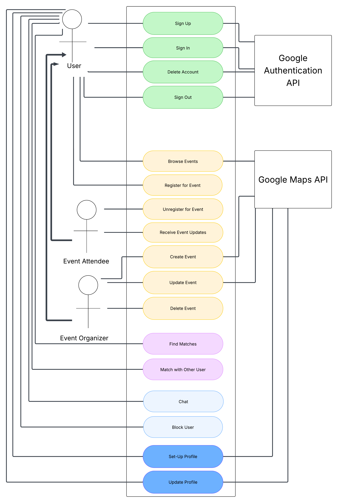
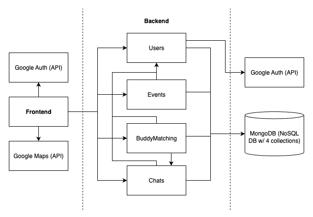
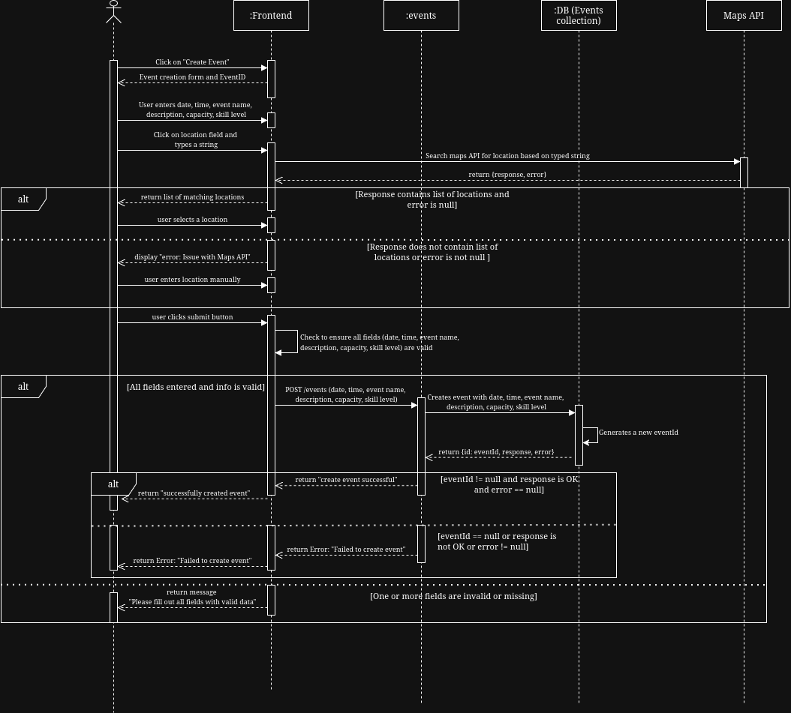
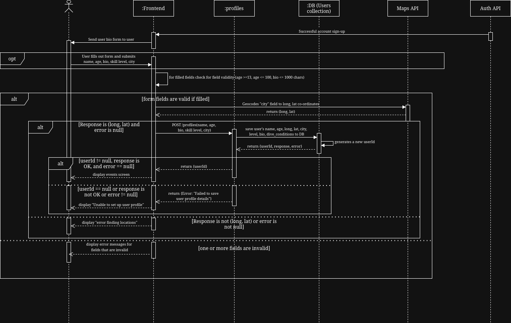
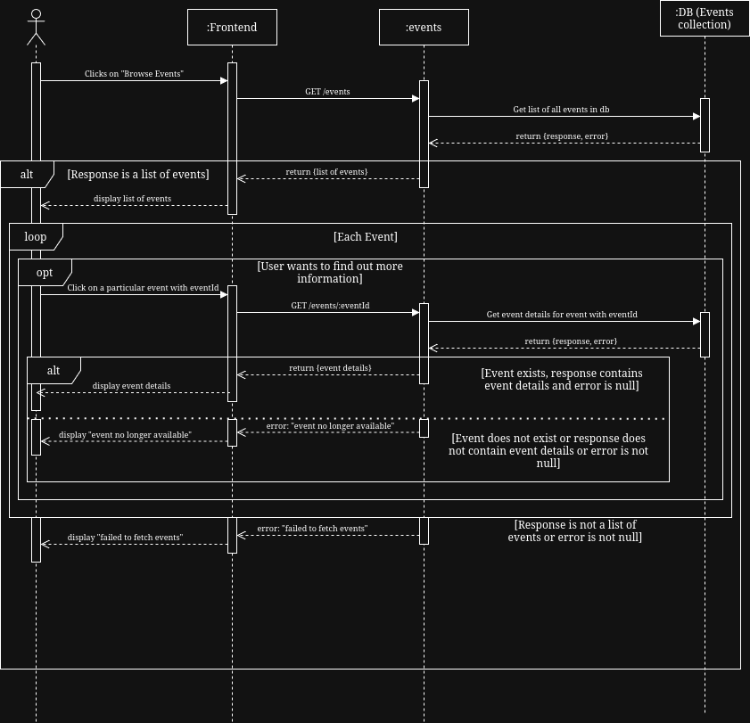
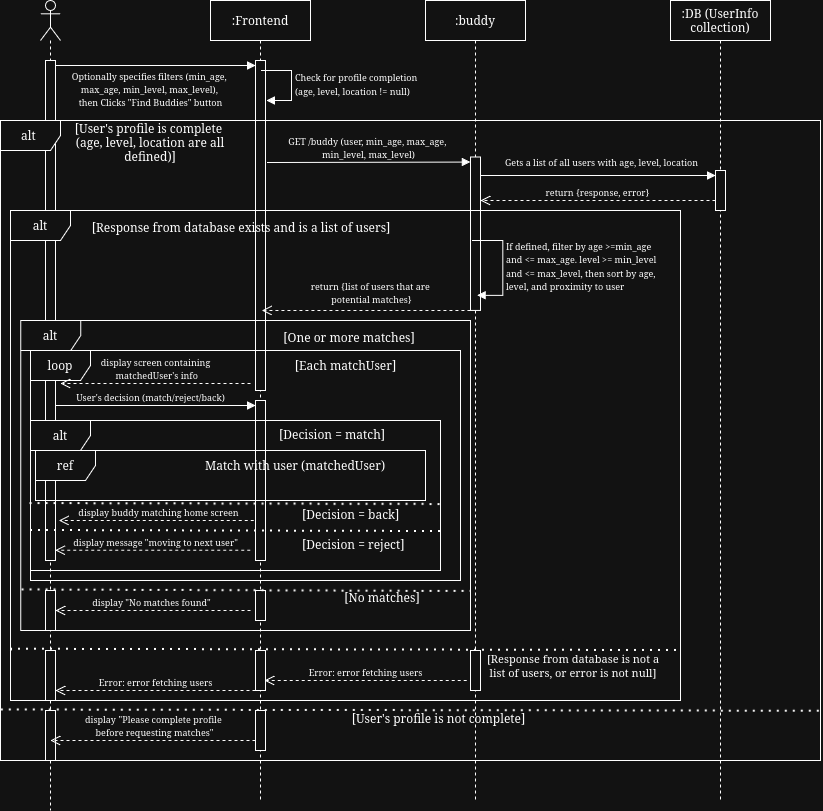
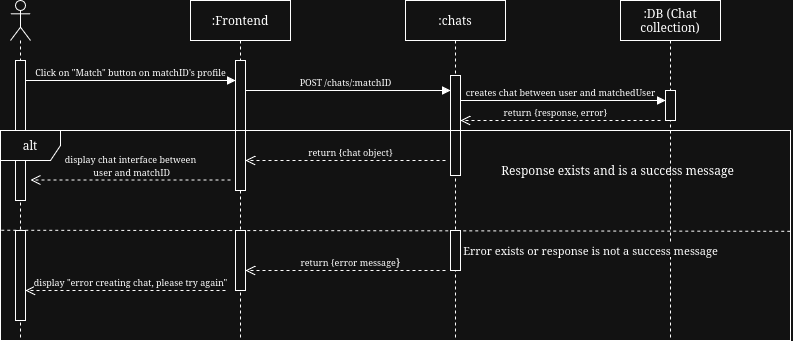

# Requirements and Design

## 1. Change History

| **Change Date**   | **Modified Sections** | **Rationale** |
| ----------------- | --------------------- | ------------- |
| Oct 27, 2025 | 4.1 Main Components<br>4.5 Dependencies Diagram | Based on M2 feedback from our TA, the following improvements were made:<ul><li>Combined "Users" and "Profiles" components into single "Users" component</li><li>Removed three separate database components into just using one "MongoDB" component (that contains three collections: users, events, chat)</li><li>"Google Maps API" no longer interacts with any backend components, it only interacts with frontend</li> |
| Oct 27, 2025 | 3.7 Non-Functional Requirements | Based on M2 feedback we changed our second non-functional requirement to be one that is more testable. At first it was about our server uptime being 99.5%, but now we opted for it to reflect our API response times, which would be easier to test for our project. |
| Oct 27, 2025 | 3.5 Formal Use Case Specifications | Changes to most specifications based on how our app ended up being implemented. <ul><li>Split the Match with Other User use case into two separate use cases: Find Matches, and Match with Other User. </li><li>Create Event use case no longer has upload image, but has description field, to reflect how the use case actually functions on the app.</li><li> Set-up profile also has upload image part removed, as users can already change their image in the “Manage Profile” screen which is separate from this use case. Additionally, all fields here are optional, as users can navigate to manage profile to add them at anytime.</li><li>Browse events no longer contains information about registering for an event, as that is handled in a separate use case.</li></ul>
 | Oct 27, 2025 | 3.4 Use Case Description | Updated use case descriptions to be more consistent with our actual implementation and use case specifications: <ul><li>Feature 2: Removes diving conditions and certificates in favor of adding bio and name. Diving conditions and certificates are relatively open ended responses that can easily be explained in the bio section.</li> <li>Feature 3: Some name/field changes to improve consistency with the rest of the document. </li><li> Feature 4: Reflects the fact that we split Match with Other User into two use cases: Find Matches and Match with Other User</li></ul>
 | Oct 27, 2025 | 3.2 Use Case Diagram | Updated to reflect how we split the Match with Other User use case into two use cases as described above. |
| Oct 27, 2025 | 4.4 Frameworks | Added Retrofit and Socket.IO frameworks for Android because they are used on the frontend for HTTP requests and live websocket for chats. |
| Nov 28, 2025 | 4.2 Databases | Changed MongoDB description to include new table for storing blocked users in (blocker, blocked) pairs. |
| Nov 28, 2025 | 4.1 APIs | Added a section for backend and REST interfaces related to the block user functionality. |
| Nov 28, 2025 | 3.1 List of Features | Edited Event feature description for consistency with the app. |
| Nov 28, 2025 | 3.4 Use Case Description | Edited descriptions for use cases that were implemented after M3. |
| Nov 28, 2025 | 4.3 External Modules | No longer using Firebase for notifications. |
| Nov 28, 2025 | 4.5 Dependencies Diagram | Update dependencies diagram |

---

## 2. Project Description

DiveBuddy is an app designed for scuba divers of all levels who are looking to connect with fellow divers and discover events that help them enhance their diving skills and enjoy safer diving experiences. The app will serve as a platform which addresses the common challenges divers face in discovering diving sessions, coordinating with dive clubs, and finding reliable dive partners. By centralizing event listings, sign-ups, and a buddy-matching system in one platform, DiveBuddy helps users easily discover upcoming dives, register for events, and connect with fellow divers nearby. This creates a stronger sense of community, encourages safer diving through reliable partnerships, and increases engagement with sports clubs organizing the activities.

What sets DiveBuddy apart is its real-time buddy matching feature and event management system. By leveraging users' profiles and preferences, the app's matching algorithm will suggest compatible dive partners based on factors such as certification levels, diving experience, location and availability. This ensures that divers can find suitable partners who match their skill level and interests, enhancing safety and enjoyment during dives. Additionally, the event management system will allow clubs to efficiently organize and manage dive events, handle registrations, and communicate with participants through notifications. This streamlines the event planning process and ensures that divers have access to a variety of diving opportunities. Overall, DiveBuddy aims to foster a vibrant diving community by making it easier for divers to connect, discover events, and enhance their diving experiences through reliable partnerships and organized activities.

---

## 3. Requirements Specification

### **3.1. List of Features**

- Authentication: To use the app, a user must use Google Authentication to Sign In. New users must Sign Up before Signing In. Users can sign out and also delete their account.

- Profile Management: After the authentication Sign Up process, the user will see a pop up form with fields that they must fill out to complete their profile. The fields will be: Name, Age, City, Experience Level (beginner, intermediate, advanced), and Bio (open text input). The user will be able to update their profile after the initial set up, in order to reflect any new changes. The City field will be a dropdown from the Google Maps API. Name will be a textbox, Age will be a number, Experience level will be a dropdown, and Bio is a text input of up to 1000 characters. A user can add a profile photo as well.

- Event Management: Users will be able to create an event and become the event organizer. When creating the event, the user will be able to fill a form with the following fields: Name (text), Date/Time (DateTimePicker), Location (with Google Maps API), user capacity (number), estimated skill level (beginner, intermediate, or advanced). The event organizer can update any of the fields of the event, as well delete the event. Users can view all of the above information about the event prior to joining, including the attendees list, and they will be added to the attendees list after joining.
Users can view all of the events they have joined/created, as well as their status of Organizer/Attendee. Users can leave an event they have joined, and it will remove themselves from the attendee list. Events can be discovered through the Browse Events tab, and users can join events from there.

- Buddy Matching: Users will be able to match with a single diving buddy if they are looking for a partner when diving because it is never recommended to go diving alone. With the user’s profile information, including their location and skill level, the buddy matching algorithm can be invoked to find a list of top other users that are compatible with the current user.

- Chat: Users can create chat rooms with other users who are attending events with them, or with a buddy they match with.

### **3.2. Use Case Diagram**



### **3.3. Actors Description**

1. **User**: An app user who is logged into the app using their Google account. Has access to all app features. Users must use Google Authentication to Sign Up and make an account.
2. **Event Organizer**: A user who has created an event is the event organizer of that event.
3. **Event Attendee**: A user who has joined an event is called an event attendee.
4. **Google Maps API**: Third Party API responsible for location data in profiles and events.
5. **Google Authentication API**: Third Party API responsible for user authentication.

### **3.4. Use Case Description**
#### Use cases for feature 1: Authentication
- Sign Up: The user uses Google Authentication to create an account
- Sign In: The user uses Google Authentication to sign into their account.
- Sign Out: The user signs out of their account.
- Delete Account: The user deletes their account (also signing them out). The user should no longer be able to sign in with their old credentials after this action is done.
  
#### Use cases for feature 2: Profile Management
- Set-Up Profile: The user sets their account information on account creation to reflect their age, location, experience level, name, and bio. Setting these preferences will allow for optimal buddy matching.
- Update Profile: The user can update their profile to reflect any changes to it that have occurred since they set up their account initially.
  
#### Use cases for feature 3: Event Management
- Create Event: A user can create an event on the app with information about the event, including name, date/time, location (with map API), user capacity, and skill level requirements. This user becomes the event organizer.
- Update Event: The event organizer can update information for an event they have made. Updates will notify users who have joined the event.
- Delete Event: The event creator can delete an event they have created. This will notify users who have joined the event and remove them from the event.
- Browse Events: Users can browse through events created by dive club owners. Events can be browsed from a list view, showcasing information about the event such as location, date and time.
- Register for Event: Users can join events that they see on their feed, given that the event has enough capacity. These users become event attendees.
- Leave Event: The user who has previously registered for an event will be able to leave the event by clicking a button.
- Chat with event organizers/attendees: Upon a user creating or joining an event, they will have access to a chat room available to all event attendees and the event organizer, where they can send messages to co-ordinate event planning or get to know each other before meeting up.

#### Use cases for feature 4: Buddy Matching
- Find Matches: A user can use the information that they’ve set in their profile to request to match with a diving buddy. The matching algorithm will find a list of top matches who have similar experience level and interests.
- Match with Other User: A user can view the profile for each match and tap on the match button if they are interested in contacting them. A chat between the user and the match will be created.

#### Use cases for feature 5: Chat
- Chat: After matching as buddy with another user, the users use the created chat room to chat with each other to coordinate joining events together, or go on diving excursions themselves. A chat room can also be opened between users who are attendees of the same event.
- Block User: When a user blocks another user, they can no longer message or receive messages from the user


### **3.5. Formal Use Case Specifications (6 Most Major Use Cases)**

#### Use Case 1: Create Event

**Description**: A user creates a new event with details including name, date/time, location, capacity, and recommended skill level. The user can add an image for the event as well. The app uses the Google Maps API to select and display the location.

**Primary actor(s)**: User, Event Organizer

**Main success scenario**:

1. User selects “Create New Event” from the Events page.
2. System displays event form (fields: title, description, date/time, capacity, skill level, location). All fields are required.
3. User enters required details except location.
4. User clicks “Location” field and searches via Google Maps API.
5. System displays suggested locations; user selects one.
6. User clicks “Submit”.
7. System validates inputs, saves event to Events DB, assigns the user as Event Organizer.
8. System displays confirmation and lists the newly created event in Browse Events.


**Failure scenario(s)**:

- 4a. Google Maps API unavailable.

	- 4a1. System shows “Cannot connect to Maps. Retry or enter address manually.”
	- 4a2. User retries from step 3 or cancels and ends use case.

- 7a. User leaves required fields blank

	- 7a1. System highlights missing fields and shows error.
	- 7a2. User completes fields → resume at step 3.

- 7b. Event save fails (DB error).

	- 7b1. System displays “Event not saved, please retry.”
	- 7b2. User retries → resume at step 6.


#### Use Case 2: Set-Up Profile

**Description**: A new user sets up their profile by entering Name, Age, City, Experience Level, and Bio.

**Primary actor(s)**: User

**Main success scenario**:

1. User signs up for the first time using Google Authentication.
2. System displays Profile Setup Form (Name, Age, City, Experience Level, Bio). All fields are optional.
3. User enters details.
4. User clicks “Submit”.
5. System validates and saves profile with location information.
6. System confirms completion.


**Failure scenario(s)**:

- 2b. Invalid format (non-numeric age or age < 13 or age > 100, bio > 1000 chars).

	- 2b1. System shows inline validation error.
	- 2b2. User corrects → resume at step 3.

- 5a. Maps API fails when geocoding city
	- 5a1. System notifies user and offers retry
	- 5a2. User retries from step 2

- 5b. Save fails (e.g., DB error).

	- 5b1. System shows error and preserves form data.
	- 5b2. User retries → resume at step 4.


#### Use Case 3: Browse Events

**Description**: A user browses events posted by other users through a list view.

**Primary actor(s)**: User, Event Attendee

**Main success scenario**:

1. User navigates to “Browse Events”.
2. System displays events (list view).
3. User selects an event to view details.
4. System displays event details (title, location, description, attendees, etc.).


**Failure scenario(s)**:

- 2a. No events found.

	- 2a1. System shows “No events available” message.
	- 2a2. User adjusts filters → resume at step 2.

- 3a. Selected event deleted/updated since list load.

	- 3a1. System shows “Event no longer available.”
	- 3a2. User returns to list → resume at step 2.


#### Use Case 4: Find Matches

**Description**: A user requests to find a diving buddy. The system computes matches based on profiles, preferences, and location.

**Primary actor(s)**: User

**Main success scenario**:

1. User navigates to “Find Buddy”.
2. User clicks “Find Buddies”.
3. System retrieves user profile and preferences.
4. System runs buddy matching algorithm.
5. System displays ranked list of compatible users one at a time.


**Failure scenario(s)**:

- 3a. User’s profile incomplete.

	- 3a1. System prompts to complete profile first.
	- 3a2. User updates their profile then tries again from step 2.

- 4a. Matching service unavailable.

	- 4a1. System shows “Unable to match now, retry later.”
	- 4a2. User retries → resume at step 2.

- 5a. No matches found.

	- 5a1. System shows “No buddies found.”
	- 5a2. User adjusts filters → resume at step 2.

#### Use Case 5: Match with Other User

**Description**: A user views a matched user’s profile and is interested in chatting with them, so they send a “Match” request to open a chat between the users.

**Primary actor(s)**: User

**Main success scenario**:
1. User clicks on “Match” button
2. System creates a chat between the two users

**Failure scenario(s)**:
- 2a. Chat creation fails.

	- 2a1. System shows “Chat unavailable, please retry.”
	- 2a2. User retries → resume at step 2.


#### Use Case 6: Chat

**Description**: Two matched users, or users attending the same event, use the in-app chat to coordinate diving plans or events.

**Primary actor(s)**: User, Event Attendee

**Main success scenario**:

1. User selects chat (with matched buddy/other event attendee for same event).
2. System loads conversation history.
3. User types and sends message.
4. System delivers message in real-time.
5. Recipient(s) receive notification and live-chat update.
6. Conversation continues.

**Failure scenario(s)**:

- 2a. Chat history fails to load.
  - 2a1. System shows “Cannot load messages, retry.”
  - 2a2. User retries → resume at step 2.

- 3a. Message invalid (too long, unsupported attachment).
  - 3a1. System shows error, prevents send.
  - 3a2. User edits message → resume at step 3.

- 4a. Network error during send.
  - 4a1. System queues message and shows “Pending.”
  - 4a2. On reconnect, system retries → resume at step 4.

- 4b. Recipient offline.
  - 4b1. System queues message and delivers when online.
  - 4b2. Resume at step 5.

- 4c. Block scenario.
  - 4c1. If recipient blocked sender, system shows “Cannot deliver message.”
  - 4c2. Use case ends.

### **3.6. Screen Mock-ups**

### **3.7. Non-Functional Requirements**

1. **Real-time User Experience SLOs (Matching and Chat)**
    - **Description**: Buddy algorithm suggestions return in ≤1.0s p95 when there are 10,000 users in the database.
    - **Justification**: This is to maintain a positive user experience. The app’s value lies in its ability for live coordination with other users, so a slow matching process will contribute to a poor user experience.
    - **Why these numbers**: 1s is the upper bound users still perceive as visual "instant" and p95 means 95% of users will be able to achieve these response times. We believe that when the app is fully released, we will see an active userbase of around 10000 members, so we will use this metric to simulate a release environment. (<https://www.nngroup.com/articles/powers-of-10-time-scales-in-ux>)
2. **API Response Times**
    - **Description**: Our backend API, which handles requests from the Android application for authentication, event registration, and chat, should respond within 500 milliseconds under normal load.
    - **Justification**: Maintaining low response times is crucial to ensuring a smooth user experience on mobile devices, where network latency can already introduce delays. A quick API response helps our app feel responsive, prevents user frustration, and ensures real-time features like chat and event registration remain seamless.
    - **Why these numbers**: According to Odown, high-performing APIs typically respond within 300–500 ms, which is considered a “very good” benchmark in the industry. This makes 500 ms a realistic and measurable performance target for our backend.(<https://odown.com/blog/api-response-time-standards>)

---

## 4. Designs Specification

### **4.1. Main Components**

1. **Users**
    - **Purpose**: Handles Google OAuth sign-up/sign-in, manages session tokens, and stores basic user identity. Also stores custom profile information about the user (age, location, experience, bio, profile photo).
    - **REST Interfaces**:
      - POST /auth/signup
        - Purpose: sign up with Google token, return JWT/session
        - Parameters: Google token from google authentication. Payload is as follows:
          ``` 
          { 
              idToken: string 
          } 
          ```
        - Returns: JWT/session token on success, error message on error
          ```
          { 
              message: string 
              data: { token: string, user: User }
          }
          ```
      - POST /auth/signin
        - Purpose: sign in with Google token, return JWT/session
        - Parameters: Google token from google authentication. Payload is as follows:
          ```
          { 
              idToken: string 
          }
          ```
        - Returns: JWT/session token on success, error message on error
          ```
          { 
              message: string 
              data: { token: string, user: User }
          }
          ```
      - GET /users
        - Purpose: get all users in the database, for debugging/admin purposes
        - Parameters: No parameters or payload required.
        - Returns: Success: The userID for the newly created user. Failure: An error message explaining what the error is
          ```
          {
              message: string
              data: { users: User[] }
          }
          ```
      - POST /users
        - Purpose: create profile for a new user
        - Parameters: name, age, bio, skill level, city (all optional). Payload is as follows:
          ```
          {
              name: string
              age: number
              bio: string
              location: string
              latitude: number
              longitude: number
              profilePicture: string
              skillLevel: one of ["Beginner", "Intermediate", "Expert"]
          }
          ```
        - Returns: Success: The user object for the new user. Failure: An error message explaining what the error is
          ```
          {
              message: string
              data: { user: User }
          }
          ```
      - GET /users/:userId
        - Purpose: retrieve a user's profile by ID
        - Parameters: userID (required).
        - Returns: Success: The user object for the retrieved user if the ID exists, otherwise an empty object if the user does not exist. Failure: An error message explaining what the error is
          ```
          {
              message: string
              data: { user: User }
          }
          ```
      - GET /users/profile
        - Purpose: retrieve the logged in user's profile
        - Parameters: None
        - Returns: Success: The user object for the signed in user. Failure: An error message explaining what the error is
          ```
          {
              message: string
              data: { user: User }
          }
          ```
      - PUT /users/:userId
        - Purpose: update user profile info by ID
        - Parameters: userID (required), {name, age, bio, skill level, city (all optional)}. Payload is as follows:
          ```
          {
              name: string
              age: number
              bio: string
              location: string
              latitude: number
              longitude: number
              profilePicture: string
              skillLevel: one of ["Beginner", "Intermediate", "Expert"]
          }
          ```
        - Returns: The updated user object if update is successful, an error message if not successful explaining what the error is
          ```
          {
              message: string
              data: { user: User }
          }
          ```
      - DELETE /users/:userId
        - Purpose: delete user profile by ID
        - Parameters: userId (required). No payload is required.
        - Returns: Success message if deletion is successful, error message if not successful explaining what the error is
          ```
          {
              message: string
          }
          ```
      - DELETE /users/
        - Purpose: delete the signed in user
        - Parameters: userId (required). No payload is required.
        - Returns: Success message if deletion is successful, error message if not successful explaining what the error is
          ```
          {
              message: string
          }
          ```

2. **Events**
    - **Purpose**: Allows creation, update, deletion, and browsing of dive events. Includes integration with Google Maps API for event location
    - **Backend Interfaces**:  
      - joinEvent: interacts with Users component  
        - **Purpose**: User will be added to the list of attendees (register) for requested event  
        - **Parameters**: userId, eventId (all required)  
        - **Returns**: Success message if user was able to successfully join the event, otherwise error message is returned
          ```
          {
            message: string
          }
          ```
      - leaveEvent: interacts with Users component  
        - **Purpose**: User will be removed from the list of attendees (unregister) for the requested event  
        - **Parameters**: userId, eventId (all required)  
        - **Returns**: Success message if user was able to successfully unregister from the event, otherwise error message is returned
          ```
          {
            message: string
          }
          ```
    - **REST Interfaces**:
      - GET /events
        - Purpose: browse all available events
        - Parameters: No payload or parameters required. 
        - Returns: On success, list of all events saved in the Events collection of database. On failure, the error message is returned
          ```
          {
              message: string
              data: { events: Event[] }
          }
          ```
      - GET /events/:eventId
        - Purpose: get the event with the given eventId
        - Parameters: eventId: required
        - Returns: On success, the Event object with the given Id. On failure, the error message is returned
          ```
          {
              message: string
              data: { event: Event }
          }
          ```
      - POST /events/
        - Purpose: create a new event w/ all event info
        - Parameters: date, time, event name, description, capacity, skill level (all required)
          ```
          {
              title: string
              description: string
              date: Date
              capacity: number
              skillLevel: one of [“Beginner”, “Intermediate”, “Expert”]
              location: string
              latitude: number
              longitude: number
              attendees: string[]
              photo: string
          }
          ```       
        - Returns: On success, returns the newly created Event object. Error message if failure.
          ```
          {
              message: string
              data: { event: Event }
          }
          ```
      - PUT /events/:eventId
        - Purpose: update event details (event owner only)
        - Parameters: eventId(required), date, time, event name, description, capacity, skill level (all optional)
          ```
          {
              title: string
              description: string
              date: Date
              capacity: number
              skillLevel: one of [“Beginner”, “Intermediate”, “Expert”]
              location: string
              latitude: number
              longitude: number
              attendees: string[]
              photo: string
          }
          ```
        - Returns: On success, returns the newly updated Event object. Error message if failure.
          ```
          {
              message: string
              data: { event: Event }
          }
          ```
      - PUT /events/join/:eventId
        - Purpose: register/join an event
        - Parameters: eventId: required
        - Returns: success message if event successfully joined, error message otherwise
          ```
          {
            message: string
          }
          ```
      - PUT /events/leave/:eventId
        - Purpose: unregister/leave an event
        - Parameters: eventId: required
        - Returns: success message if event successfully left, error message otherwise
          ```
          {
            message: string
          }
          ```
      - DELETE /events/:eventId
        - Purpose: delete an event (event owner only)
        - Parameters: eventId (required)
        - Returns: success message if success, error message if failure
          ```
          {
            message: string
          }
          ```
3. **BuddyMatching**
    - **Purpose**: Runs the buddy matching algorithm and returns the matched results to user
    - **Backend Interfaces**:  
      - getAllBuddies: interacts with Users component  
        - **Purpose**: Runs the buddy matching algorithm to find all users that are the best matches for the user based on user’s level, age, and location  
        - **Parameters**: user, minLevel, maxLevel, minAge, maxAge  
        - **Returns**:  
          - Success: a success message and a list of match buddies otherwise error message is returned  
          - Failure: failure message with instructions
            ```
            {
              message: string
              data: { buddies: { user: User, distance: number } }
            }
            ```
    - **REST Interfaces**:
      - GET /buddy
        - Purpose: Triggers the buddy matching algorithm to allow users to find others to match with, returns a list of “best matching” users based on the current user’s profile information.
        - Parameters: 
          user: the current user’s profile information
          minLevel: minimum skill level of other users the current user is willing to match with
          maxLevel: maximum skill level of other users the current user is willing to match with
          minAge: minimum age of other users the current user is willing to match with
          maxAge: maximum age of other users the current user is willing to match with
          ```
          {
            user: User
            minLevel: one of [“Beginner”, “Intermediate”, “Expert”]
            maxLevel: one of [“Beginner”, “Intermediate”, “Expert”]
            minAge: number
            maxAge: number
          }
          ```
        - Returns:
          - Success: A list of users that meet the filter criteria above returned by the matching algorithm, containing the complete profile information for each user
          - Failure: An error message
          ```
          {
            message: string
            data: { buddies: { user: User, distance: number } [] }
          }
          ```


4. **Chats**
    - **Purpose**: Provides in-app chat between matched users
    - **Backend Interface**:
      - createChat: interacts with Users and Messages components
        - Purpose: Creates a new direct or group chat between users
        - Parameters: creatorId, peerId, name (all required)
        - Returns: Success message and chat object if creation is successful, otherwise error message.
          ```
          {
            "message": "Chat created successfully",
            "chat": {
              "chatId": "string",
              "name": "string",
              "members": ["string"],
              "createdAt": "Date"
            }
          }
          ```

      - getUserChats: interacts with Users component
        - Purpose: Retrieves all chats associated with a given user, including last message and timestamp.
        - Parameters: userId (required)
        - Returns: A list of chat summaries for that user.
          ```
          {
            "chats": [
              {
                "chatId": "string",
                "name": "string",
                "lastMessage": "string",
                "updatedAt": "Date"
              }
            ]
          }
          ```

      - getMessagesByChat: interacts with Messages component
        - Purpose: Fetches all messages within a given chat for the requesting user, ordered chronologically.
        - Parameters: chatId, userId (both required)
        - Returns: A list of messages belonging to the chat.
          ```
          {
            "messages": [
              {
                "messageId": "string",
                "senderId": "string",
                "content": "string",
                "timestamp": "Date"
              }
            ]
          }
          ```

      - deleteChat: interacts with Users and Messages components
        - Purpose: Deletes or deactivates a chat if the requesting user has permission to do so.
        - Parameters: chatId, requesterId (both required)
        - Returns: Success or error message depending on permission and outcome.
          ```
          {
            "message": "Chat deleted successfully"
          }
          ```


    - **REST Interfaces**:
      - GET /chats/
        - Purpose: get all chats that are related to the user
        - Parameters: None
        - Returns: On success, a list of all the chats. On failure, an error message.
          ```
          {
            data: Chat []
          }
          ```

      - POST /chats/
        - Purpose: create a new chat room between 2 users.
        - Parameters: peerId is the userId of the other user, and the name is the name of the chatroom (optional).Payload is as follows:
          ```
          {
            peerId: string
            name: string
          }
          ```
        - Returns: On success, returns the new Chat object. On failure, an error message.
          ```
          {
              data: Chat
              error: string
          }
          ```

      - GET /chats/:chatId
        - Purpose: get the Chat object associated with the given chatId
        - Parameters: chatId (required). No payload
        - Returns: On success, the requested Chat with the given chatId. On failure, an error message.
          ```
          {
              data: Chat
	          error: string
          }
          ```


      - GET /chats/messages/:chatId
        - Purpose: gets all the messages in the Chat object with associated chatId. The results are paginated, and are sorted from most recent to least recent.
        - Parameters: chatId (required), limit (optional) number of chats, before (optional) filter chats. 
        - Returns: a list of the messages given the parameters and pagination
          ```
          {
            messages: Message []
            chatId: string
            limit: number
            count: number	
            hasMore: boolean
          }
          ```

      - POST /chats/:chatId/messages
        - Purpose: add a new message to the given Chat that is specified by the chatId
        - Parameters: chatId (required). Payload is as follows:
          ```
          {
            content: string
          }
          ```
        - Returns: On success, returns the new message. On failure, returns an error message.
          ```
          {
            populatedMessage: Message
            error: string
          }
          ```
5. **Block**
	- Purpose: Facilitate the ability for users to block and unblock other users
	- Backend Interface:
		- blockUser: Interacts with Users component
			- Purpose: Blocks the target user from being able to communicate with the calling user
			- Parameters: targetUserId (required)
			- Returns: Success message if successfully blocked target user, otherwise error message.
			```
			{
  				"message": "User blocked successfully"
			}
  			```
		- unblockUser: Interacts with Users component
			- Purpose: Unblocks the target user, allowing them to communicate with the calling user again
			- Parameters: targetUserId (required)
			- Returns: Success message if successfully unblocked target user, otherwise error message
     		```
			{
  				“message”: ‘User unblocked successfully’
			}
			```
		- getBlockedUsers: Interacts with Users component
			- Purpose: Fetches a list of all users that the calling user has blocked
			- Parameters: none
			- Returns: A list of UserIds corresponding to users that the calling user has blocked
           ```
			{
  				"message”: “Blocked users fetched successfully”,
  				"data": { blockedUserIds: UserId[] }
			}
			```

		- checkIfBlockedBy: Interacts with Users component
			- Purpose: Checks if the calling user is blocked by the target user
			- Parameters: targetUserId (required)
			- Returns: A success message and True if the calling user is blocked by the target user, a success message and False if the calling user is not blocked by the target user, an error message if an error is encountered while 		determining whether or not the calling user has been blocked by the target user
			```
			{
  				“message”: “Block status checked successfully”,
  				“data”: true
			}
			```
	- REST Interfaces:
		- POST /block/
			- Purpose: Adds the target user to the calling user’s blocked users
   			- Parameters: targetUserId (required). Payload is as follows:
             ```
              {
  				targetUserId: string
			  }
             ```
      		- Returns: Success message on success, otherwise failure message
            ```
              {
  				message: string
			  }
             ```
		- DELETE /block/:targetUserId
  			- Purpose: Removes the target user from the calling user's blocked users
     		- Parameters: targetUserId (required). Payload is as follows:
       		 ```
              {
  				targetUserId: string
			  }
    		```
    		- Returns: Success message on success, otherwise failure message
            ```
              {
  				message: string
			  }
             ```
		- GET /block
  			- Purpose: Gets the list of the UserIds of the calling user's blocked users.
    		- Parameters: None
      		- Returns: Success message along with a list of UserIds on success, error message on error
          	```
              {
  				message: string
          		data: {
          			blockedUserIds: string[]
			  		}
    		   }
             ```
		- GET /block/check/:targetUserId
  			- Purpose: Checks whether or not the calling user is blocked by the target user
     		- Parameters: targetUserId (required). Payload is as follows:
         	```
              {
  				targetUserId: string
			  }
    		```
    		- Returns: Success message along with a boolean flag for whether or not the calling user is blocked by the target user, otherwise error message
        	```
              {
  				message: string
         		data: {
					isBlocked: boolean
         		}
			  }
    		```   


### **4.2. Databases**

1. **MongoDB**
    - **Purpose**: For storing data related to users, events, and chats, and blocked users. We will use 1 database with 4 collections: users, events, chats, and blocks.
    - **Reason**: NoSQL database was chosen over SQL database for more flexible schemas that may evolve over time

### **4.3. External Modules**

1. **Google Auth**
    - **Purpose**:  For secure OAuth login/sign-up with minimal setup
2. **Google Maps API**
    - **Purpose**: For location-based event creation and browsing

### **4.4. Frameworks**

1. **AWS (EC2 + S3)**
    - **Purpose**: For scalable backend hosting and image storage (e.g., storing user profile pictures, event images)
    - **Reason**: Chosen over Microsoft Azure and Google Cloud Platform because AWS is most mature, widely adopted, and as students we want to learn it for job competitiveness
2. **Node.js with Express.js**
    - **Purpose**: Backend API framework chosen for simplicity, large ecosystem, and real-time websocket support with Socket.IO
3. **Retrofit with Android**
    - **Purpose**: Frontend framework for sending HTTP requests to the backend
4. **Socket.io with Android**
    - **Purpose**: Frontend framework for websocket connections, used for real-time chats

### **4.5. Dependencies Diagram**



### **4.6. Use Case Sequence Diagram (5 Most Major Use Cases)**
#### 1. **Create Event**


#### 2. **Set-Up Profile**


#### 3. **Browse Events**


#### 4. **Find Matches**


#### 5. **Match with Other User**



### **4.7. Design and Ways to Test Non-Functional Requirements**
1. **Real-time User Experience SLOs (Matching and Chat)**
    - **Validation**: Efficient database queries and a WebSocket-based implementation are used to enable real-time matching and chat updates, ensuring responses are delivered within 1 second under typical load. This can be tested using load-testing tools like K6 or Artillery to simulate 10,000 users and measure 95th-percentile response times.
2. **API Response Times**
    - **Validation**: The Express.js backend uses asynchronous I/O, optimized query handling, and minimal middleware to reduce latency, ensuring API responses remain within the 500 ms target. This can be tested using tools such as Postman or K6 to measure response times of key endpoints under normal load.
