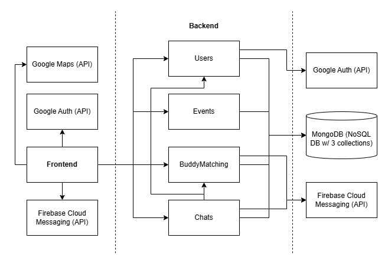

# Requirements and Design

## 1. Change History

| **Change Date**   | **Modified Sections** | **Rationale** |
| ----------------- | --------------------- | ------------- |
| _Nothing to show_ |

---

## 2. Project Description

DiveBuddy is an app designed for scuba divers of all levels who are looking to connect with fellow divers and 
discover events that help them enhance their diving skills and enjoy safer diving experiences. The app will serve as a platform which addresses the common challenges divers face in discovering diving sessions, coordinating with dive clubs, and finding reliable dive partners. By centralizing event listings, sign-ups, and a buddy-matching system in one platform, DiveBuddy helps users easily discover upcoming dives, register for events, and connect with fellow divers nearby. This creates a stronger sense of community, encourages safer diving through reliable partnerships, and increases engagement with sports clubs organizing the activities.

What sets DiveBuddy apart is its real-time buddy matching feature and event management system. By leveraging users' profiles and preferences, the app's matching algorithm will suggest compatible dive partners based on factors such as certification levels, diving experience, location and availability. This ensures that divers can find suitable partners who match their skill level and interests, enhancing safety and enjoyment during dives. Additionally, the event management system will allow clubs to efficiently organize and manage dive events, handle registrations, and communicate with participants through notifications. This streamlines the event planning process and ensures that divers have access to a variety of diving opportunities. Overall, DiveBuddy aims to foster a vibrant diving community by making it easier for divers to connect, discover events, and enhance their diving experiences through reliable partnerships and organized activities.   

---

## 3. Requirements Specification

### **3.1. List of Features**

- Authentication: To use the app, a user must use Google Authentication to Sign In. New users must Sign Up before Signing In. Users can sign out and also delete their account.

- Profile Management: After the authentication Sign Up process, the user will see a pop up form with fields that they must fill out to complete their profile. The fields will be: Name, Age, City, Experience Level (beginner, intermediate, advanced), and Bio (open text input). The user will be able to update their profile after the initial set up, in order to reflect any new changes. The City field will be a dropdown from the Google Maps API. Name will be a textbox, Age will be a number, Experience level will be a dropdown, and Bio is a text input of up to 1000 characters. A user can add a profile photo as well.

- Event Management: Users will be able to create an event and become the event organizer. When creating the event, the user will be able to fill a form with the following fields: Name (text), Date/Time (DateTimePicker), Location (with Google Maps API), user capacity (number), estimated skill level (beginner, intermediate, or advanced). They can also upload an image for the event. The event organizer can update any of the fields of the event, as well delete the event. Users can view all of the above information about the event prior to joining, including the attendees list, and they will be added to the attendees list after joining.
Users can view all of the events they have joined/created, as well as their status of Organizer/Attendee. Users can leave an event they have joined, and it will remove themselves from the attendee list. Events can be discovered through the Browse Events tab, and users can join events from there.

- Buddy Matching: Users will be able to match with a single diving buddy if they are looking for a partner when diving because it is never recommended to go diving alone. With the user’s profile information, including their location and skill level, the buddy matching algorithm can be invoked to find a list of top other users that are compatible with the current user. 

- Chat: Users can create chat rooms with other users who are attending events with them, or with a buddy they match with.

### **3.2. Use Case Diagram**

### **3.3. Actors Description**
1. **User**: An app user who is logged into the app using their Google account. Has access to all app features. Users must use Google Authentication to Sign Up and make an account.
2. **Event Organizer**: A user who has created an event is the event organizer of that event.
3. **Event Attendee**: A user who has joined an event is called an event attendee. 
4. **Google Maps API**: Third Party API responsible for location data in profiles and events.
5. **Google Authentication API**: Third Party API responsible for user authentication.

### **3.4. Use Case Description**
- Use cases for feature 1: Authentication
1. **Sign Up**: The user uses Google Authentication to create an account 
2. **Sign In**: The user uses Google Authentication to sign into their account. 
3. **Sign Out**: The user signs out of their account.
4. **Delete Account**: The user deletes their account (also signing them out). The user should no longer be able to sign in with their old credentials after this action is done.

- Use cases for feature 2: Profile Management
1. **Set-Up Profile**: The user sets their account information on account creation to reflect their age, location, certification level, experience level, and preferred diving conditions. Setting these preferences will allow for optimal buddy matching.
2. **Update Profile**: The user can update their profile to reflect any changes to it that have occurred since they have set up their account initially. 

- Use cases for feature 3: Event Management
1. **Create Event**: A user can create an event on the app with information about the event, including name, date/time, location (with map API), user capacity, gear/certification requirements. This user becomes the event organizer.
2. **Update Event**: The event organizer can update information for an event they have made. Updates will notify users who have joined the event.
3. **Delete Event**: The event creator can delete an event they have made. This will notify users who have joined the event, and remove them from the event.
4. **Unregister for Event**: The user who has previously registered for an event will be able to unregister for it by clicking a button.
5. **Browse Events**: Users can browse through events created by dive club owners. Events can be browsed from a list view or in a map view, showcasing information about the event such as location, date and time.
6. **Register for Event**: Users can join events that they see on their feed, given that the event has enough capacity. These users become event attendees.
7. **Receive Event Updates**: After a user has joined an event, they will receive notifications if the event creator makes any updates to the event, or deletes the event.
8. **Chat with event organizers/attendees**: Upon a user creating or joining an event, they will have access to a chat room available to all event attendees and the event organizer, where they can send messages to co-ordinate event planning or get to know each other before meeting up.

- Use cases for feature 4: Buddy Matching 
1. **Match with Other User**: A user can use the information that they’ve set in their profile to request to match with a diving buddy. The matching algorithm will find a list of top matches who have similar experience level and interests. 

- Use cases for feature 5: Chat
1. **Chat with Matched User/ Event Attendee**: After matching as buddy with another user, the users can open a chat room to  start chatting with each other to coordinate joining events together, or go on diving excursions themselves. A chat room can also be opened between users who are attendees of the same event. 
2. **Block**: When a user blocks another user, they can no longer message or receive messages from the user

### **3.5. Formal Use Case Specifications (5 Most Major Use Cases)**

#### Use Case 1: Create Event

**Description**: A user creates a new event with details including name, date/time, location, capacity, and recommended skill level. The user can add an image for the event as well. The app uses the Google Maps API to select and display the location.

**Primary actor(s)**: User, Event Organize 
    
**Main success scenario**:
1. User selects “Create New Event” from the Events page.
2. System displays event form (fields: title, date/time, capacity, skill level, location, image). All fields except image are required.
3. User enters required details.
4. User clicks “Location” field and searches via Google Maps API.
5. System displays suggested locations; user selects one.
6. User clicks “Submit”.
7. System validates inputs, saves event to Events DB, assigns the user as Event Organizer.
8. System displays confirmation and lists the newly created event in Browse Events.

**Failure scenario(s)**:
- 2a. User leaves required fields blank
    - 2a1. System highlights missing fields and shows error.
    - 2a2. User completes fields → resume at step 3.

- 4a. Google Maps API unavailable.
    - 4a1. System shows “Cannot connect to Maps. Retry or enter address manually.”
    - 4a2. User retries/enters address → resume at step 5; cancels → ends use case.

- 6a. Image upload fails.
    - 6a1. System shows error with retry/skip option.
    - 6a2. User retries/skips → resume at step 6.

- 7a. Event save fails (DB error).
    - 7a1. System displays “Event not saved, please retry.”
    - 7a2. User retries → resume at step 6.

#### Use Case 2: Set-Up Profile

**Description**: A new user sets up their profile by entering Name, Age, City, Experience Level, and Bio.

**Primary actor(s)**: User
    
**Main success scenario**:
1. User signs up for the first time using Google Authentication.
2. System displays Profile Setup Form (Name, Age, City, Experience Level, Preferred Diving Conditions, Bio, Profile Photo). All fields are mandatory except the Profile Photo.
3. User enters details and optionally uploads photo.
4. User clicks “Submit”.
5. System validates and saves profile.
6. System confirms completion.

**Failure scenario(s)**:
- 2a. User skips required fields.
    - 2a1. System prevents submit and highlights missing fields.
    - 2a2. User completes fields → resume at step 3.

- 2b. Invalid format (non-numeric age, bio > 1000 chars).
    - 2b1. System shows inline validation error.
    - 2b2. User corrects → resume at step 3.

- 3a. Photo upload fails.
    - 3a1. System notifies user and offers retry/skip.
    - 3a2. User retries/skips → resume at step 4.

- 5a. Save fails (e.g., DB error).
    - 5a1. System shows error and preserves form data.
    - 5a2. User retries → resume at step 4.

#### Use Case 3: Browse Events

**Description**: A user browses events posted by other users through a list view or a map view.

**Primary actor(s)**: User, Event Attendee
    
**Main success scenario**:
1. User navigates to “Browse Events”.
2. System displays events (list + map view).
3. User applies filters (date, location, skill).
4. User selects an event to view details.
5. System displays event details (title, location, description, attendees, etc.).
6. User clicks “Register” to join event.
7. System checks capacity/requirements, then registers user as Event Attendee.
8. System confirms registration.

**Failure scenario(s)**:
- 2a. No events found.
    - 2a1. System shows “No events available” message.
    - 2a2. User adjusts filters → resume at step 2.

- 2b. Map API fails.
    - 2b1. System hides map view, keeps list view active.
    - 2b2. User continues browsing → resume at step 3.

- 4a. Selected event deleted/updated since list load.
    - 4a1. System shows “Event no longer available.”
    - 4a2. User returns to list → resume at step 2.

- 6a. Event at full capacity.
    - 6a1. System shows “Event full” and disables registration.
    - 6a2. User browses other events → resume at step 2.

- 6b. User does not meet skill/gear requirements.
    - 6b1. System shows unmet requirement message.
    - 6b2. User cancels or updates profile → ends.

#### Use Case 4: Match with Other User

**Description**: A user requests to find a diving buddy. The system computes matches based on profiles, preferences, and availability.

**Primary actor(s)**: User
    
**Main success scenario**:
1. User navigates to “Find Buddy”.
2. User clicks “Match”.
3. System retrieves user profile and preferences.
4. System runs buddy matching algorithm.
5. System displays ranked list of compatible users.
6. User selects a buddy profile.
7. System sends request to selected buddy.
8. If buddy accepts, system establishes match and opens chat (see UC5).

**Failure scenario(s)**:
- 3a. User’s profile incomplete.
    - 3a1. System prompts to complete profile first.
    - 3a2. User updates profile → resume at step 3.

- 4a. Matching service unavailable.
    - 4a1. System shows “Unable to match now, retry later.”
    - 4a2. User retries → resume at step 4.

- 5a. No matches found.
    - 5a1. System shows “No buddies found, try widening filters.”
    - 5a2. User adjusts filters → resume at step 4.
 
- 7a. Buddy unavailable or blocks request.
    - 7a1. System shows “User unavailable.”
    - 7a2. User selects another → resume at step 6.

- 8a. Chat creation fails.
    - 8a1. System shows “Chat unavailable, please retry.”
    - 8a2. User retries → resume at step 8.

#### Use Case 5: Chat with Matched User/ Event Attendee

**Description**: Two matched users, or users attending the same event, use the in-app chat to coordinate diving plans or events.

**Primary actor(s)**: User, Event Attendee
    
**Main success scenario**:
1. User selects chat (with matched buddy/other event attendee for same event).
2. System loads conversation history.
3. User types and sends message.
4. System delivers message in real-time.
5. Recipient(s) receive notification and live-chat update.
6. Conversation continues.

**Failure scenario(s)**:
- 2a. Chat history fails to load.
    - 2a1. System shows “Cannot load messages, retry.”
    - 2a2. User retries → resume at step 2.

- 3a. Message invalid (too long, unsupported attachment).
    - 3a1. System shows error, prevents send.
    - 3a2. User edits message → resume at step 3.

- 4a. Network error during send.
    - 4a1. System queues message and shows “Pending.”
    - 4a2. On reconnect, system retries → resume at step 4.

- 4b. Recipient offline.
    - 4b1. System queues message and delivers when online.
    - 4b2. Resume at step 5.

- 4c. Block scenario.
    - 4c1. If recipient blocked sender, system shows “Cannot deliver message.”
    - 4c2. Use case ends.

### **3.6. Screen Mock-ups**

### **3.7. Non-Functional Requirements**

1. **Real-time Experience SLOs (Matching and Chat)**
    - **Description**: Buddy suggestions return in ≤ 1.0 s p95 when there are 10,000 users in the database.
    - **Justification**: This is to maintain a positive user experience. The app’s value lies in its ability for live coordination with other users, so a slow matching process will contribute to a poor user experience. 1s is the upper bound users still perceive as “instant” ; p95 means 95% of users will be able to achieve these response times. We believe that when the app is fully released, we will see an active userbase of around 10000 members, so we will use this metric to simulate a release environment. (https://www.nngroup.com/articles/powers-of-10-time-scales-in-ux/?utm_source=chatgpt.com)
2. ...

---

## 4. Designs Specification
### **4.1. Main Components**
1. **Users**
    - **Purpose**: Handles Google OAuth sign-up/sign-in, manages session tokens, and stores basic user identity
2. **Profiles**
    - **Purpose**: Stores and manages user profiles (age, location, certification, experience, preferences)
3. **Events**
    - **Purpose**: Allows creation, update, deletion, and browsing of dive events. Includes integration with Google Maps API for event location

4. **BuddyMatching**
    - **Purpose**: Runs the buddy matching algorithm and returns the matched results to user

5. **Chats**
    - **Purpose**: Provides in-app chat between matched users

### **4.2. Databases**
1. **MongoDB**
    - **Purpose**: For storing data related to profiles, events, and chat message
    - **Reason**: NoSQL database was chosen over SQL database for more flexible schemas that may evolve over time

### **4.3. External Modules**
1. **Google Auth** 
    - **Purpose**:  For secure OAuth login/sign-up with minimal setup
2. **Google Maps API** 
    - **Purpose**: For location-based event creation and browsing
3. **Firebase Cloud Messaging (FCM)** 
    - **Purpose**: For event update notifications and buddy match alerts

### **4.4. Frameworks**
1. **AWS (EC2 + S3)**
    - **Purpose**: For scalable backend hosting and image storage (e.g., storing user profile pictures, event images)
    - **Reason**: Chosen over Microsoft Azure and Google Cloud Platform because AWS is most mature, widely adopted, and as students we want to learn it for job competitiveness
2. **Node.js with Express.js**
    - **Purpose**: Backend API framework chosen for simplicity, large ecosystem, and real-time websocket support with Socket.IO

### **4.5. Dependencies Diagram**

### **4.6. Use Case Sequence Diagram (5 Most Major Use Cases)**
1. [**[WRITE_NAME_HERE]**](#uc1)\
[SEQUENCE_DIAGRAM_HERE]
2. ...

### **4.7. Design and Ways to Test Non-Functional Requirements**
1. [**[WRITE_NAME_HERE]**](#nfr1)
    - **Validation**: ...
2. ...