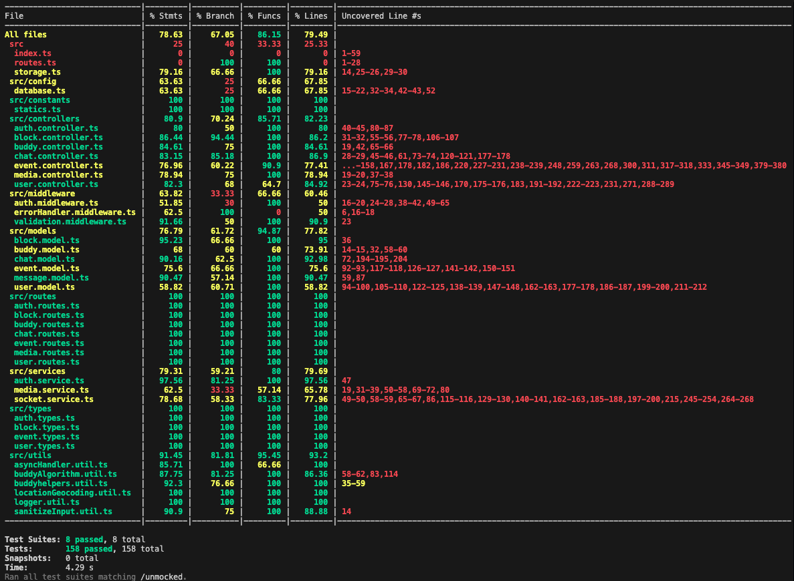
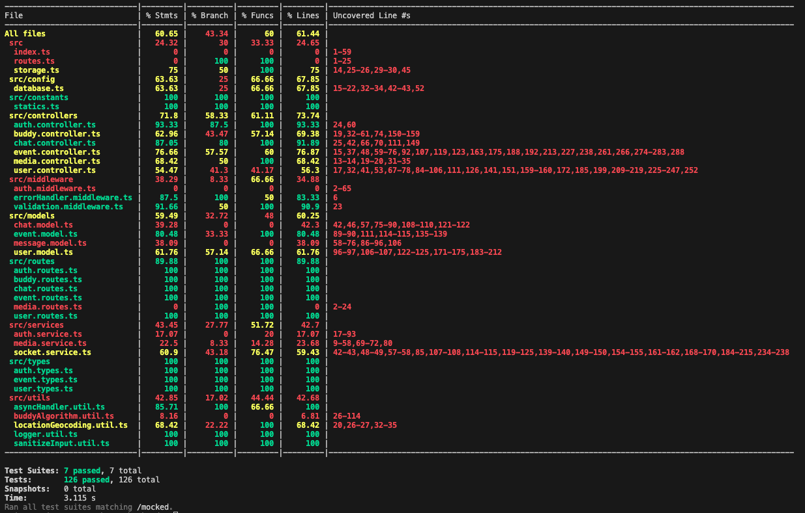
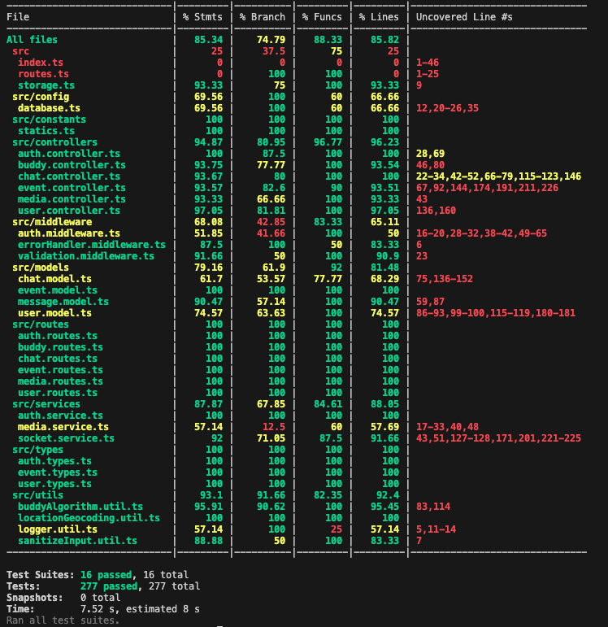
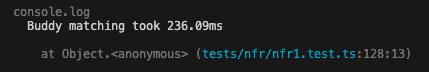
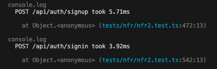
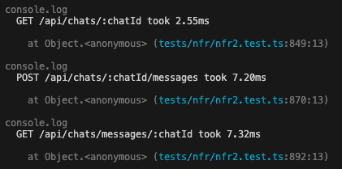
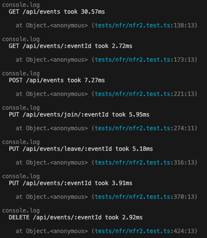
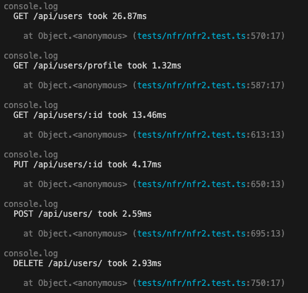
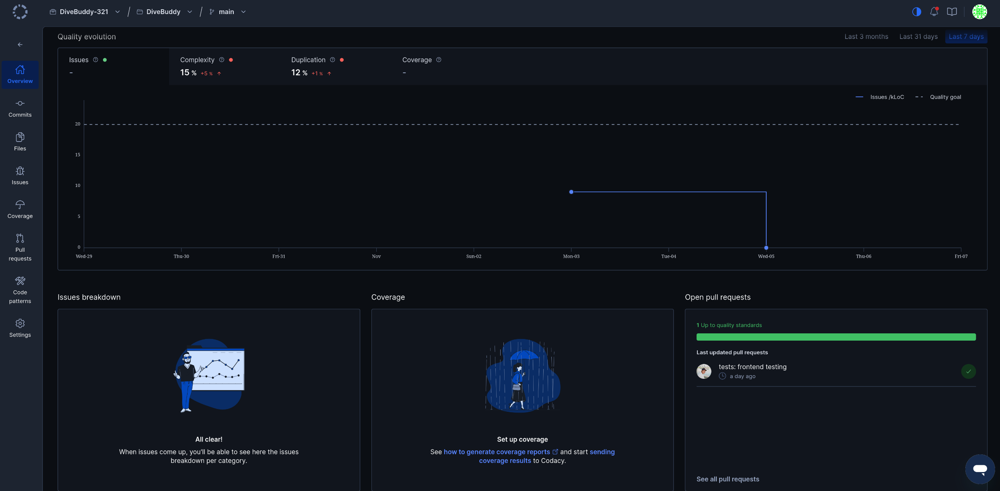

# Testing and Code Review

## 1. Change History

| **Change Date**   | **Modified Sections** | **Rationale** |
| ----------------- | --------------------- | ------------- |
| _Nothing to show_ |

---

## 2. Back-end Test Specification: APIs

### 2.1. Locations of Back-end Tests and Instructions to Run Them

#### 2.1.1. Tests

| **Interface**                 | **Describe Group Location, No Mocks**                | **Describe Group Location, With Mocks**            | **Mocked Components**              |
| ----------------------------- | ---------------------------------------------------- | -------------------------------------------------- | ---------------------------------- |
| **POST /auth/signup**          | [`backend/tests/unmocked/authNM.test.ts#L48`] | [`backend/tests/mocked/authM.test.ts#L21`] | Google Authentication API/ Auth Service |
| **POST /auth/signin**          | [`backend/tests/unmocked/authNM.test.ts#L463`] | [`backend/tests/mocked/authM.test.ts#L107`] | Google Authentication API/ Auth Service |
| **GET /buddy**                 | [`backend/tests/unmocked/buddyNM.test.ts#L64`] | [`backend/tests/mocked/buddyM.test.ts#L66`] | User DB |
| **GET /chats**                 | [`backend/tests/unmocked/chatNM.test.ts#L231`] | [`backend/tests/mocked/chatM.test.ts#L91`] | Chat DB |
| **POST /chats**                 | [`backend/tests/unmocked/chatNM.test.ts#L139`] | [`backend/tests/mocked/chatM.test.ts#L218`] | Chat DB |
| **GET /chats/:chatId**             | [`backend/tests/unmocked/chatNM.test.ts#L264`] | [`backend/tests/mocked/chatM.test.ts#L145`] | Chat DB |
| **GET /chats/messages/:chatId**      | [`backend/tests/unmocked/chatNM.test.ts#L426`] | [`backend/tests/mocked/chatM.test.ts#L440`] | Chat DB |
| **POST /chats/:chatId/messages/**     | [`backend/tests/unmocked/chatNM.test.ts#L329`] | [`backend/tests/mocked/chatM.test.ts#L317`] | Chat DB |
| **GET /events**     | [`backend/tests/unmocked/eventNM.test.ts#L66`] | [`backend/tests/mocked/eventM.test.ts#L67`] | Event DB |
| **GET /events/:eventId**     | [`backend/tests/unmocked/eventNM.test.ts#L79`] | [`backend/tests/mocked/eventM.test.ts#L137`] | Event DB |
| **POST /events**     | [`backend/tests/unmocked/eventNM.test.ts#L134`] | [`backend/tests/mocked/eventM.test.ts#L217`] | Event DB |
| **PUT /events/join/:eventId**     | [`backend/tests/unmocked/eventNM.test.ts#L232`] | [`backend/tests/mocked/eventM.test.ts#L442`] | Event DB |
| **PUT /events/leave/:eventId**     | [`backend/tests/unmocked/eventNM.test.ts#L279`] | [`backend/tests/mocked/eventM.test.ts#L560`] | Event DB |
| **PUT /events/:eventId**     | [`backend/tests/unmocked/eventNM.test.ts#L326`] | [`backend/tests/mocked/eventM.test.ts#L312`] | Event DB |
| **DELETE /events/:eventId**     | [`backend/tests/unmocked/eventNM.test.ts#L412`] | [`backend/tests/mocked/eventM.test.ts#L674`] | Event DB |
| **POST /media/upload**     | [`backend/tests/unmocked/mediaNM.test.ts#L130`] | [`backend/tests/mocked/mediaM.test.ts#L136`] | Media Service |
| **GET /users**     | [`backend/tests/unmocked/userNM.test.ts#L80`] | [`backend/tests/mocked/userM.test.ts#L70`] | User DB |
| **GET /users/profile**     | [`backend/tests/unmocked/userNM.test.ts#L93`] | [`backend/tests/mocked/userM.test.ts#L96`] | User DB |
| **GET /users/:id**     | [`backend/tests/unmocked/userNM.test.ts#L108`] | [`backend/tests/mocked/userM.test.ts#L110`] | User DB |
| **DELETE /users/**     | [`backend/tests/unmocked/userNM.test.ts#L432`] | [`backend/tests/mocked/userM.test.ts#L379`] | User DB |
| **DELETE /users/:id**     | [`backend/tests/unmocked/userNM.test.ts#L369`] | [`backend/tests/mocked/userM.test.ts#L317`] | User DB |
| **PUT /users/:id**     | [`backend/tests/unmocked/userNM.test.ts#L154`] | [`backend/tests/mocked/userM.test.ts#L151`] | User DB |
| **POST /users/**     | [`backend/tests/unmocked/userNM.test.ts#L257`] | [`backend/tests/mocked/userM.test.ts#L235`] | User DB |

#### 2.1.2. Commit Hash Where Tests Run

`[Insert Commit SHA here]`

#### 2.1.3. Explanation on How to Run the Tests

1. **Clone the Repository**:

   - Open your terminal and run:
     ```
     git clone https://github.com/DiveBuddy-321/DiveBuddy.git
     ```

2. **Enter the Backend Directory**:

   - Navigate to the backend directory:
     ```
     cd DiveBuddy/backend
     ```

3. **Create a .env File**:

   - Create a `.env` file in the root of the `backend` directory with the following content:
     ```
     JWT_SECRET=your_test_secret_key
     MONGODB_URI=mongodb://localhost:27017/
     ```
   - Replace `your_test_secret_key` with a valid secret key for testing purposes (can use the same one as in your own project).

4. **Install Dependencies**:
    - Install the required packages using npm:
      ```
      npm install
      ```

5. **Run the Tests**:
    - To run the tests without mocking, execute:
      ```
      npx jest /unmocked --runInBand --coverage
      ```
    - To run the tests with mocking, execute:
      ```
      npx jest /mocked --runInBand --coverage
      ``` 
    - To execute non-functional requirement tests, run:
      ```
      npx jest /nfr --runInBand --coverage
      ```
    - To run all tests, execute:
      ```
      npx jest --runInBand --coverage
      ```
    - To run a specific test file, (for example nfr1.test.ts), execute:
      ```
      npx jest nfr1 --runInBand --coverage
      ```


### 2.2. GitHub Actions Configuration Location

`~/.github/workflows/test.yml`

### 2.3. Jest Coverage Report Screenshots for Tests Without Mocking



### 2.4. Jest Coverage Report Screenshots for Tests With Mocking



### 2.5. Jest Coverage Report Screenshots for Both Tests With and Without Mocking



Total coverage is only around 85% because some files such as index.ts, routes.ts, storage.ts and database.ts are involved with setting up the server and routing, and are not directly tested by any test suites.
Furthermore, the authentication middleware in authMiddleware.ts is not directly tested, because many of the functions need a valid Google OAuth token to work, which is difficult to simulate in tests. The authentication middleware is mainly mocked throughout the tests, and as a result, the coverage for that file is low. In the models and controller files, some lines are not directly reached in the tests because 
they are error handling code for edge cases that are often caught in other parts of the code. All test cases testing each endpoint focus on all success and failures scenarios, but some specific error handling code is not directly reached because of being caught in other areas of the code. The other files that have low coverage are utility files that contain helper functions that are not directly used when calling the 
exposed backend APIs, so their coverage is low as well.

## 3. Back-end Test Specification: Tests of Non-Functional Requirements

### 3.1. Test Locations in Git

| **Non-Functional Requirement**  | **Location in Git**                              |
| ------------------------------- | ------------------------------------------------ |
| **Buddy Matching Response Times** | [`backend/tests/nfr/nfr1.test.js`]|
| **Auth/Chat/User/ChatAPI Response Times**          | [`backend/tests/nfr/nfr2.test.js`] |

### 3.2. Test Verification and Logs

- **Buddy Matching Response Times**

  - **Verification:** This test suite populates the test database with 10000 simulated users and then calls the buddy matching API endpoint to ensure that the response time is within 1s, as our non-functional requirement specifies.
  - **Log Output**

    

- **Auth/Chat/User/ChatAPI Response Times**
  - **Verification:** This test suite tests every API endpoint related to authentication, chat, user management, and event management to ensure that each endpoint responds within 500ms, as specified in our non-functional requirements.
  - **Log Output**

    

    

    

    
---

## 4. Front-end Test Specification

### 4.1. Location of Front-end Test Suite

The front-end test suite is located in the following directory:

```
app/src/androidTest/java/com/cpen321/usermanagement/ui/screens/
```

Before running any test, make sure the following are satisfied:
1. The app is connected to the backend server: http://10.0.2.2:3000/api/
2. Authentication token is set by ensuring you have previously launched the app and logged in, advancing past the authentication screen.

### Test Files:
1. **ProfileScreenTest.kt**: End-to-end tests for profile management functionality
   - Location: `app/src/androidTest/java/com/cpen321/usermanagement/ui/screens/ProfileScreenTest.kt`

---

### 4.2. Test Cases

#### Profile Use Cases

- **Use Case 1: Profile Completion** (Success Scenario)
  - **Description:** Verifies that a user can successfully complete their profile sign-up form by filling in all required fields (Name, Age, City, Experience Level, Bio) and saving the profile to the backend. The test validates that the profile is persisted correctly and reflected in both the backend and ViewModel. 

  - **Expected Behaviors:**
    | **Scenario Steps** | **Test Case Steps** |
    |--------------------|---------------------|
    | 1. The user opens the Profile Completion screen. | Ensure user is authenticated. Load profile into ViewModel. Set content to `ProfileCompletionScreen`. Wait for profile loading to complete. Assert "Complete Your Profile" screen title is displayed. |
    | 2. The app displays the profile form with Name, Age, City, Experience Level, and Bio fields. The Save button is disabled. | Assert Name, Age, City, Experience Level, and Bio fields are present on screen. Assert Save button is present on screen. |
    | 3. The user inputs their name. | Scroll to "Name" field. Replace text with "Test User E2E". Wait for idle. |
    | 4. The user inputs their age. | Scroll to "Age" field. Replace text with "25". Wait for idle. |
    | 5. The user inputs a city query, and the app displays city suggestions. | Scroll to "City" field and click it. Replace "City" field text with "Vancouver". Manually trigger city query for "Vancouver" with PlacesClient attached. Wait for city suggestions to appear (timeout: 15 seconds). |
    | 6. The user selects a city from the suggestions. | Select "Vancouver, BC, Canada" from suggestions (prefer exact match, fallback to first Vancouver suggestion). Wait for idle. |
    | 7. The user selects an experience level. | Scroll to "Experience Level" field and click it. Click "BEGINNER" option. Wait for idle. |
    | 8. The user inputs their bio. | Scroll to "Bio" field. Replace text with "I love diving and exploring underwater worlds! This is my E2E test profile.". Wait for idle. |
    | 9. The Save button becomes enabled. | Scroll to "Save" button. Assert it is enabled. |
    | 10. The user presses the Save button. | Click "Save" button. Wait for idle. |
    | 11. The profile is successfully saved to the backend. | Wait for profile saving to complete (timeout: 10 seconds). Assert no error message is displayed after saving. Reload profile from repository. Assert Name matches "Test User E2E". Assert Age matches 25. Assert Skill Level matches "beginner". Assert Bio matches expected text. |
    | 12. The screen refreshes, and the updated profile information is reflected in the backend and ViewModel. | Reload profile into ViewModel. Assert ViewModel state matches saved values. |

  - **Test Logs:**
    ```
    Test: test_01_success_scenario_profile_completion
    Status: [PASSED/FAILED]
    Duration: ~15-30 seconds
    ```

- **Use Case 2: Profile Update** (Success Scenario)
  - **Description:** Verifies that a user can successfully update their existing profile by modifying all fields (Name, Age, City, Experience Level, Bio) and saving the changes. The test validates that the updated profile is persisted correctly in the backend and reflected in the ViewModel.

  - **Expected Behaviors:**
    | **Scenario Steps** | **Test Case Steps** |
    |--------------------|---------------------|
    | 1. The user opens the Manage Profile screen. | Ensure user is authenticated. Load profile into ViewModel. Set content to `ManageProfileScreen`. Wait for profile loading to complete (2 seconds). Assert "Manage Profile" screen title is displayed. |
    | 2. The app displays the profile form with existing profile data pre-filled. The Save button is disabled. | Assert Name, Age, City, Experience Level, and Bio fields are present on screen. Assert Save button exists on screen. |
    | 3. The user updates their name. | Scroll to "Name" field. Replace text with "Updated Test User". Wait for idle. Add small delay (300ms). |
    | 4. The user updates their age. | Scroll to "Age" field. Replace text with "26". Wait for idle. Add small delay (300ms). |
    | 5. The user updates their experience level. | Scroll to "Experience Level" field and click it. Wait for idle. Click "INTERMEDIATE" option. Wait for idle. Add small delay (300ms). |
    | 6. The user updates their bio. | Scroll to "Bio" field. Replace text with "Updated bio: I'm passionate about scuba diving and exploring the ocean!". Wait for idle. Add small delay (300ms). |
    | 7. The user updates their city query and selects a new city from suggestions. | Scroll to "City" field and click it. Wait for idle. Replace "City" field text with "Toronto". Wait for idle. Manually trigger city query for "Toronto" with PlacesClient attached. Wait for city suggestions (2 seconds). Select "Toronto, ON, Canada" from suggestions (fallback to first Toronto suggestion). Wait for idle. |
    | 8. The Save button becomes enabled. | Scroll to "Save" button. Assert it is enabled. Wait for idle. |
    | 9. The user presses the Save button. | Click "Save" button. Wait for idle. |
    | 10. The profile is successfully updated in the backend. | Wait for profile updating to complete (timeout: 10 seconds). Assert no error message is displayed after updating. Wait for backend to process (1 second). Reload profile from repository. Assert Name matches "Updated Test User". Assert Age matches 26. Assert Skill Level matches "intermediate". Assert Bio matches expected text. |
    | 11. The screen refreshes, and the updated profile information is reflected in the backend and ViewModel. | Reload profile into ViewModel. Wait for ViewModel to finish loading (2 seconds). Assert ViewModel state matches updated values (Name, Age, Skill Level, Bio). |

  - **Test Logs:**
    ```
    Test: test_02_success_scenario_profile_update
    Status: [PASSED/FAILED]
    Duration: ~20-35 seconds
    Prerequisites: test_01_success_scenario_profile_completion should run first (creates profile)
    ```

- **Use Case 3: Profile Form Validation** (Failure Scenario)
  - **Description:** Verifies that the profile completion form properly validates required fields before saving. The test checks that validation errors are displayed for empty required fields (Name, City, Experience Level) and that the save operation is prevented when validation fails. 

  - **Expected Behaviors:**
    | **Scenario Steps** | **Test Case Steps** |
    |--------------------|---------------------|
    | 1. The user opens the Profile Completion screen. | Ensure user is authenticated. Set content to `ProfileCompletionScreen`. Wait for idle. |
    | 2. The app displays the profile form with Name, Age, City, Experience Level, and Bio fields. | Assert profile form fields are present on screen. |
    | 3. The user attempts to save without filling required fields. | Scroll to "Save" button. Click "Save" button. Wait for idle. |
    | 4. The app displays "Required" error for Name field. | Assert "Required" error message is displayed. |
    | 5. The app displays "Pick a city from suggestions" error for City field. | Assert "Pick a city from suggestions" error message is displayed. |
    | 6. The app displays "Select experience level" error for Experience Level field. | Assert "Select experience level" error message is displayed. |
    | 7. The Save operation does not proceed. | Assert that saving did not proceed (isSavingProfile is false). |
    | 8. The user fills in the Name field. | Scroll to "Name" field. Input "Test User" in text field. Wait for idle. |
    | 9. The user attempts to save again. | Scroll to "Save" button. Click "Save" button. Wait for idle. |
    | 10. The app still displays validation errors for other required fields (City, Experience Level). | Assert validation errors for City and Experience Level are still displayed. |

  - **Test Logs:**
    ```
    Test: test_profile_form_validation
    Status: [PASSED/FAILED]
    Duration: ~5-10 seconds
    ```

- **Use Case 4: Profile Update Validation with Invalid Data** (Failure Scenario)
  - **Description:** Verifies that the profile update form properly validates input data and displays error messages for invalid values. The test checks that validation errors are displayed for invalid age (below minimum) and invalid city (not selected from suggestions), and that the save operation is prevented when validation fails.

  - **Expected Behaviors:**
    | **Scenario Steps** | **Test Case Steps** |
    |--------------------|---------------------|
    | 1. The user opens the Manage Profile screen. | Ensure user is authenticated. Load profile into ViewModel. Set content to `ManageProfileScreen`. Wait for profile loading to complete (2 seconds). Assert "Manage Profile" screen title is displayed. |
    | 2. The app displays the profile form with existing profile data. The Save button is disabled. | Assert Save button exists on screen. |
    | 3. The user makes a change to the Name field. | Scroll to "Name" field. Replace text with "New Name". Wait for idle. |
    | 4. The Save button becomes enabled. | Scroll to "Save" button. Assert it is enabled. |
    | 5. The user enters an invalid age (below 13). | Scroll to "Age" field. Replace text with "5". Wait for idle. Add small delay (300ms). |
    | 6. The user edits the City field without selecting from suggestions. | Scroll to "City" field and click it. Wait for idle. Replace "City" field text with "SomeCity". Wait for idle. Add small delay (500ms). |
    | 7. The user presses the Save button. | Scroll to "Save" button. Assert it is enabled. Click "Save" button. Wait for idle. Add delay for validation to trigger (1.5 seconds). |
    | 8. The app displays "Enter a valid age (13–120)" error message for Age field. | Assert "Enter a valid age" error message is displayed. |
    | 9. The app displays "Pick a city from suggestions" error message for City field. | Scroll to "City" field. Assert "Pick a city from suggestions" error message is displayed. |
    | 10. The Save operation does not proceed (isSavingProfile remains false). | Assert that saving did not proceed (isSavingProfile is false). |

  - **Test Logs:**
    ```
    Test: test_profile_update_with_changes
    Status: [PASSED/FAILED]
    Duration: ~10-15 seconds
    Prerequisites: User must have an existing profile
    ```

- **Use Case 5: Skip Button Functionality** (Failure Scenario)
  - **Description:** Verifies that the Skip button on the profile completion screen works correctly. The test checks that clicking the Skip button triggers the onProfileCompleted callback and does not initiate a profile save operation.

  - **Expected Behaviors:**
    | **Scenario Steps** | **Test Case Steps** |
    |--------------------|---------------------|
    | 1. The user opens the Profile Completion screen. | Ensure user is authenticated. Load profile into ViewModel. Set content to `ProfileCompletionScreen` with onProfileCompleted callback. Wait for profile loading to complete (5 seconds timeout). Assert "Complete Your Profile" screen title is displayed. |
    | 2. The app displays the profile form and a Skip button. | Assert Skip button is displayed on screen. Assert Skip button is enabled. |
    | 3. The user presses the Skip button. | Scroll to "Skip" button. Click "Skip" button. Wait for idle. Add small delay (500ms). |
    | 4. The onProfileCompleted callback is triggered. | Assert skipButtonClicked flag is true (callback was called). |
    | 5. No profile save operation is initiated. | Assert that saving did not proceed (isSavingProfile is false). |

  - **Test Logs:**
    ```
    Test: test_skip_button_profile_completion
    Status: [PASSED/FAILED]
    Duration: ~5-10 seconds
    ```

- **Use Case 6: Profile Completion Validation (All Fields)** (Failure Scenario)
  - **Description:** Verifies comprehensive validation of all profile fields including empty fields, invalid age, bio length limits, and unselected city/experience level. The test checks that all validation errors are displayed correctly and that the save operation is prevented when any validation fails.

  - **Expected Behaviors:**
    | **Scenario Steps** | **Test Case Steps** |
    |--------------------|---------------------|
    | 1. The user opens the Profile Completion screen. | Ensure user is authenticated. Load profile into ViewModel. Set content to `ProfileCompletionScreen`. Wait for profile loading to complete (5 seconds timeout). Assert "Complete Your Profile" screen title is displayed. |
    | 2. The app displays the profile form with Name, Age, City, Experience Level, and Bio fields. | Assert profile form fields are present on screen. |
    | 3. The user attempts to save without filling any fields. | Scroll to "Save" button. Click "Save" button. Wait for idle. Add delay for validation to trigger (1.5 seconds). |
    | 4. The app displays "Required" error for Name field. | Assert "Required" error message is displayed. |
    | 5. The app displays "Pick a city from suggestions" error for City field. | Assert "Pick a city from suggestions" error message is displayed. |
    | 6. The app displays "Select experience level" error for Experience Level field. | Assert "Select experience level" error message is displayed. |
    | 7. The Save operation does not proceed. | Assert that saving did not proceed (isSavingProfile is false). |
    | 8. The user enters invalid data (empty name, invalid age, too-long bio, unselected city, unselected experience). | Scroll to "Name" field. Replace text with empty string. Wait for idle. Scroll to "Age" field. Replace text with "5" (invalid age). Wait for idle. Scroll to "Bio" field. Replace text with 501-character string (too long). Wait for idle. |
    | 9. The user fills in a valid name. | Scroll to "Name" field. Replace text with "Test Name". Wait for idle. |
    | 10. The user attempts to save again. | Scroll to "Save" button. Click "Save" button. Wait for idle. Add delay for validation to trigger (1.5 seconds). |
    | 11. The app displays "Enter a valid age (13–120)" error message for Age field. | Assert "Enter a valid age" error message is displayed. |
    | 12. The app displays "Pick a city from suggestions" error message for City field. | Assert "Pick a city from suggestions" error message is displayed. |
    | 13. The app displays "Select experience level" error message for Experience Level field. | Assert "Select experience level" error message is displayed. |
    | 14. The app prevents saving due to bio exceeding 500 characters (validation exists in form state, but error is not displayed in UI). | Note: Bio validation exists in form state but is not displayed in UI. The validation still prevents saving (canSave() checks bio length). |
    | 15. The Save operation does not proceed. | Assert that saving did not proceed (isSavingProfile is false). |

  - **Test Logs:**
    ```
    Test: test_profile_completion_validation_all_fields
    Status: [PASSED/FAILED]
    Duration: ~10-15 seconds
    ```

---

Continue writing other tests here:

---

## Test Execution Instructions

### Prerequisites:
1. **Local Backend Running:**
   - Backend server must be running at `http://10.0.2.2:3000/api/`
   - This is the Android emulator's address for `localhost:3000`

2. **Authentication:** (ensure before every test)
   - User must have previously launched the app and logged in, advancing past the authentication screen.
   - Authentication token will be stored and reused by tests
   - If token is missing, tests will fail with a message similar to: "Test requires authentication. Please sign in to the app first."

3. **Google Places API:**
   - MAPS_API_KEY must be configured in BuildConfig
   - Places API must be enabled for the API key
   - Network connectivity required for city autocomplete

4. **Test Execution Order:** some tests need to be executed in a particular order
   - `test_02_success_scenario_profile_update` should run after `test_01_success_scenario_profile_completion` (updates existing profile)

### Running Tests:

```bash
# Run all ProfileScreenTest tests
./gradlew connectedAndroidTest --tests "com.cpen321.usermanagement.ui.screens.ProfileScreenTest"

# Run specific test
./gradlew connectedAndroidTest --tests "com.cpen321.usermanagement.ui.screens.ProfileScreenTest.test_01_success_scenario_profile_completion"

# Run all tests
./gradlew connectedAndroidTest
```

### Expected Test Results:

| Test Name | Expected Status | Duration | Dependencies |
|-----------|----------------|----------|--------------|
| test_01_success_scenario_profile_completion | PASSED | ~15-30s | Backend, Auth |
| test_02_success_scenario_profile_update | PASSED | ~20-35s | Backend, Auth, Test 1 |
| test_profile_form_validation | PASSED | ~5-10s | Backend, Auth |
| test_profile_update_with_changes | PASSED | ~10-15s | Backend, Auth |
| test_skip_button_profile_completion | PASSED | ~5-10s | Backend, Auth |
| test_profile_completion_validation_all_fields | PASSED | ~10-15s | Backend, Auth |

---

## 5. Automated Code Review Results

### 5.1. Commit Hash Where Codacy Ran

`a97a33a65cbd4bdae90eb20c647a90aebf6fb6d1`

### 5.2. Unfixed Issues per Codacy Category
No issues remaining as per screenshot below:


### 5.3. Unfixed Issues per Codacy Code Pattern

- Not applicable, no issues remaining as per screenshot in section above

### 5.4. Justifications for Unfixed Issues

- Not Applicable
